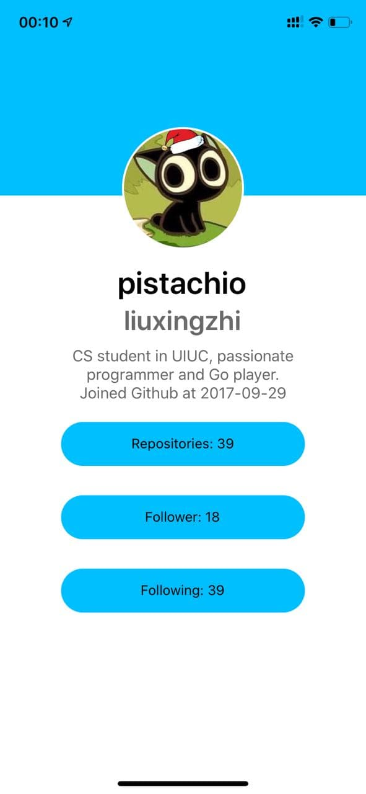
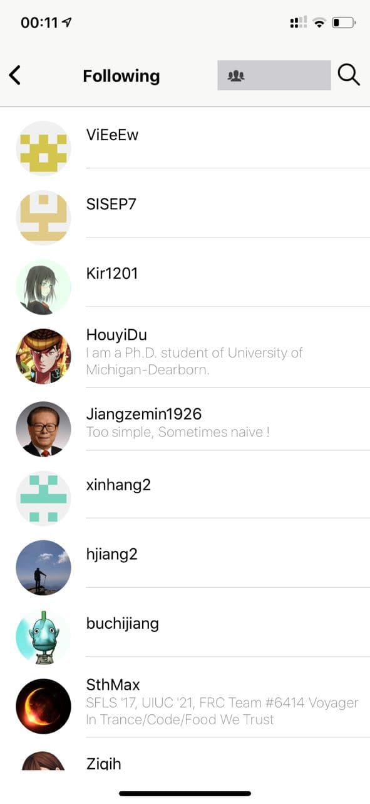
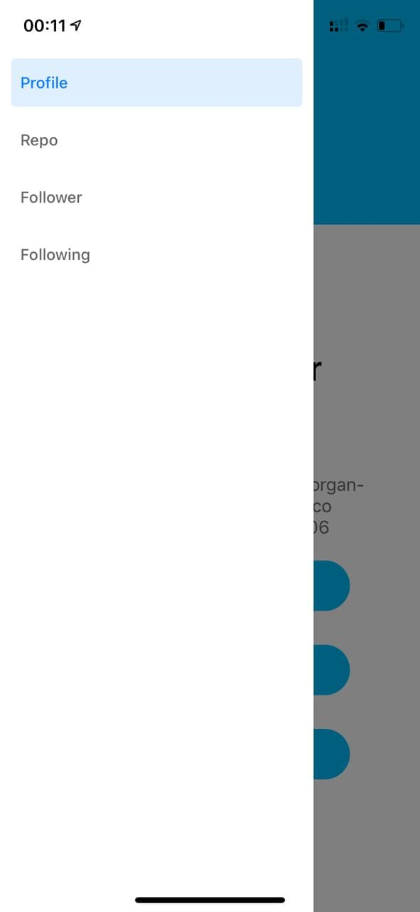

# Github Mobile

## OS support
The following OS configurations should be used when testing:
- Linux (ubuntu)
 
## Environment Need
- Node.js
- Chrome Browser
- Webstorm
- Expo

## Configuration
There two parts of the configuration
- Phone:
    - install Expo on the phone
- Labtop:
    - run the following commands to start server
    ```bash
    npm install
    expo start
    ```
Then a QR code will appear. Scan the QR code using phone. The app will start on the phone


## Some Demo
### Profile Page 
The Home page is our github profile page
If it runs successfully, we should be able to see the following information on the page
- Profile avatar image view
- Name
- GitHub username
- Bio
- Website
- Email
- Public Repos count: Clickable: able to navigate to Repositories Screen
- Followers count: Clickable: able to navigate to Followers Screen
- Following count: Clickable: able to navigate to Following Screen
- Profile creation date




### Repo Page 
Go to the Repo Page, we should be able to see a list of our repositories


### Following Page
Go to the Following Page, we should be able to see a list of our repositories


### Follower Page
Go to the Follower Page, we should be able to see a list of our repositories
Same as follower

### Navigation 
There are two kinds of navigation in this app
1. many icons on the screen are clickable
2. swipe to left, navigation drawer will show up


### Additional Functionality
1. Support navigating to other users and navigating back.
2. Support search in repos, following, and followers pages.
3. Loading alert.